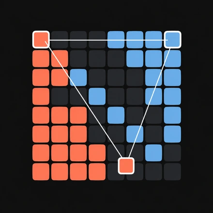

<p align="center">
  
</p>

# MAM-Bench

**Compare language models by how well their agent groups steer multi-agent simulations.**

Each simulation creates 16 separate model controlled agents challenged to understand the simulation's rules,
cooperatively plan toward a goal, coordinate through a shared message board, and execute
their strategy. MAM-Bench measures the resulting change in ordinary-agent outcomes
against a paired, rule-based world. Run the same suite with different models to
compare their ability to steer a complex system toward a predefined goal.

[](https://github.com/JoeHelbing/mam-bench/actions/workflows/ci.yml)
[](https://github.com/JoeHelbing/mam-bench/releases/latest)
[](LICENSE)

[How it works](#how-it-works) | [Quickstart](#quickstart) |
[Custom suites](docs/custom-test-suite.md) | [Reference](#reference)

> [!IMPORTANT]
> **Research-stage benchmark.** The shipped conditions were selected from
> exploratory scripted interventions, not independent held-out qualification or
> language-model evaluations. The suite, interfaces, and scoring may change;
> this is not a standardized model ranking.

The [project overview](https://joehelbing.net/post/mam-bench) introduces the idea.

## How it works

Each case runs one selected model in a group of agents with a specific goal.
The two worlds start with the same seed and settings:

```text
                    one case + one seed
                   /                   \
    ordinary world                     controlled world
    all agents follow rules             selected agents use the model
                   \                   /
           compare ordinary-agent outcomes
                         v
                signed case score
```

The model-controlled agents can coordinate, but the score comes from their
*effect on the ordinary agents*, not from judging their conversations. The
shipped suite contains six cases in three matched-seed goal pairs:

| Simulation | Goal pair | Measured outcome |
| --- | --- | --- |
| Schelling (2 cases) | Integration / segregation | Final ordinary-agent neighbor homophily |
| Civil Violence, citizen control (2 cases) | Increase / decrease participation | Ordinary-citizen participation and revolution |
| Civil Violence, police control (2 cases) | Increase / decrease participation | The same ordinary-citizen outcomes |

Each case produces a signed score. The **Combined Benchmark Score** sums all
case scores (six in the shipped suite), including negative ones. One invocation
evaluates **one model**; compare totals only when the suite and scoring version
are identical.
Model responses and resulting trajectories can still vary between runs. See
[rules and scoring](docs/rules-and-scoring.md) for the exact formulas and world
mechanics.

## Quickstart

You need [uv](https://docs.astral.sh/uv/) and an OpenAI-compatible endpoint
that supports tool calls. Bring your own model and endpoint: the repo does not
ship either, and compatibility varies by server. Python 3.14 is required.

```bash
git clone https://github.com/JoeHelbing/mam-bench.git
cd mam-bench
uv python install 3.14.7
uv sync --frozen
```

To verify the checkout **without model calls or provider charges**:

```bash
uv run --no-sync python -m unittest discover -s tests -v
```

For an evaluation, create `.scratch/model.yaml` (run `mkdir -p .scratch` first).
The directory is Git-ignored. Replace the placeholders with a real model ID and
endpoint; do not put credentials in YAML:

```yaml
runtime: openai-compatible
model: YOUR_MODEL_ID
base_url: https://YOUR-ENDPOINT.example/v1
api_key_env: MAM_MODEL_API_KEY
```

Export `MAM_MODEL_API_KEY` in the environment, including for a local server
that ignores its value: this adapter still requires the variable. Keep secrets
out of the repo. Then run the shipped suite:

```bash
uv run --no-sync main.py --model .scratch/model.yaml --output results/default
```

**This makes real model requests and can incur substantial charges.** Check
endpoint support and pricing before running all six cases. Each invocation
creates a new output directory and does not overwrite a previous run. Results
include model conversations; handle them as sensitive data. See
[artifacts and failures](docs/artifacts-and-failures.md) for the saved records
and failure behavior.

You can replace the six cases with a YAML suite of your own:

```bash
uv run --no-sync main.py --model .scratch/model.yaml \
  --suite path/to/suite.yaml --output results/custom
```

The [custom suite guide](docs/custom-test-suite.md) lists every allowed field.
The shipped cases select `max_steps: 30`; custom cases can choose another
positive integer in either simulation. For OpenRouter instead, select
`runtime: openrouter` with `model` and `provider` in the model YAML, and set
`OPENROUTER_API_KEY` in the environment or `.env`. Model sampling, tool choice,
request budgets, and compaction settings are validated in
[config.py](src/mam_bench/config.py). If you use mise, `mise install` and
`mise run setup` prepare the pinned project tools and dependencies.

## Reference

- [Rules and scoring](docs/rules-and-scoring.md) - world mechanics, goals, formulas,
  and comparability limits.
- [Artifacts and failures](docs/artifacts-and-failures.md) - trajectories,
  messages, partial results, retries, and sensitive output.
- [Architecture and source walkthrough](docs/architecture.md) - where the
  runner, simulations, sessions, and persistence live.
- [Custom test suite YAML](docs/custom-test-suite.md) - fields and validation
  for explicit test cases.

See [CONTRIBUTING.md](CONTRIBUTING.md) for changes and bug reports,
[CHANGELOG.md](CHANGELOG.md) for releases, and [LICENSE](LICENSE) for Apache-2.0.
